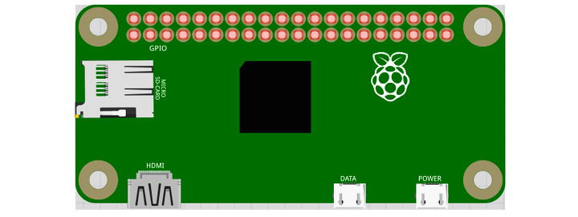

# Raspberry Pi Model Zero

[](https://circleci.com/gh/nerves-project/nerves_system_rpi0)
[](https://hex.pm/packages/nerves_system_rpi0)

This is the base Nerves System configuration for the Raspberry Pi Zero and
Raspberry Pi Zero W. See
[`nerves_system_rpi3a`](https://github.com/nerves-project/nerves_system_rpi3a)
for support for the Raspberry Pi Zero 2 W.

If you are *not* interested in [Gadget Mode](http://www.linux-usb.org/gadget/)
then check out
[nerves_system_rpi](https://github.com/nerves-project/nerves_system_rpi).  That
system configures the USB port in host mode by default and is probably more
appropriate for your setup.


<br><sup>[Image credit](#fritzing)</sup>

| Feature              | Description                     |
| -------------------- | ------------------------------- |
| CPU                  | 1 GHz ARM1176JZF-S              |
| Memory               | 512 MB                          |
| Storage              | MicroSD                         |
| Linux kernel         | 6.1 w/ Raspberry Pi patches     |
| IEx terminal         | UART `ttyAMA0` Can be changed to HDMI |
| GPIO, I2C, SPI       | Yes - [Elixir Circuits](https://github.com/elixir-circuits) |
| ADC                  | No                              |
| PWM                  | Yes, but no Elixir support      |
| UART                 | 1 available - `ttyAMA0`         |
| Camera               | Yes - via rpi-userland          |
| Ethernet             | No                              |
| WiFi                 | Supported on the Pi Zero W      |
| Bluetooth            | [Supported on the Pi Zero W](#bluetooth) |
| Audio                | HDMI/Stereo out                 |

## Using

The most common way of using this Nerves System is create a project with `mix
nerves.new` and to export `MIX_TARGET=rpi0`. See the [Getting started
guide](https://hexdocs.pm/nerves/getting-started.html#creating-a-new-nerves-app)
for more information.

If you need custom modifications to this system for your device, clone this
repository and update as described in [Making custom
systems](https://hexdocs.pm/nerves/customizing-systems.html).

## USB OTG support

One of the goals of this system is to make it possible to do most development
via one USB cable. That cable, when plugged into the USB OTG port, powers the
Raspberry Pi Zero and provides local networking. Via the network connection, one
can access an IEx prompt via ssh, transfer files via sftp, run firmware updates,
use Erlang distribution and anything else that works over IP.

IMPORTANT: The Raspberry Pi Zero has two USB ports. The OTG one is the "middle"
one. The other one is power-only.

When you connect the USB OTG port to your laptop, it should "just" work if
you're using OSX or Linux. If you're on Windows and want to access networking
natively (not through a Linux VM), you will need to install
[`linux.inf`](https://elixir.bootlin.com/linux/v4.19.102/source/Documentation/usb/linux.inf).
This file is unsigned and will fail to install unless you disable signed driver
enforcement. The basic idea is to go to settings, go to the advanced boot
settings and navigate the menus to boot with it off. There are examples on the
web.

## Console and kernel message configuration

If you're debugging networking or the boot process, you'll want to use the
Raspberry Pi's UART pins on the GPIO connector (the HDMI output can be made to
work, but won't be a good development experience).

You will need to use a USB-to-UART adapter and connect it to the UART pins on
the Raspberry Pi's GPIO header. Make sure to use a USB-to-UART adapter with 3.3V
logic levels. This is most of them and to make things confusing, most adapters
can supply 5V. Just don't connect the 5V wire.

## Supported WiFi devices

The base image includes drivers for the onboard Raspberry Pi Zero W wifi module
(`brcmfmac` driver). Due to the USB port being placed in gadget mode, this
system does not support USB WiFi adapters.

## Bluetooth

[BlueHeronTransportUART](https://github.com/blue-heron/blue_heron_transport_uart)
supports bluetooth on the Pi Zero W using `ttyS0`.
See details
[here](https://github.com/nerves-project/nerves_system_rpi0/issues/224#issuecomment-913799838).

## Audio

The Raspberry Pi has many options for audio output. This system supports the
HDMI and stereo audio jack output. The Linux ALSA drivers are used for audio
output.

The general Raspberry Pi audio documentation mostly applies to Nerves. For
example, to force audio out the HDMI port, run:

```elixir
cmd("amixer cset numid=3 2")
```

Change the last argument to `amixer` to `1` to output to the stereo output jack.

## Provisioning devices

This system supports storing provisioning information in a small key-value store
outside of any filesystem. Provisioning is an optional step and reasonable
defaults are provided if this is missing.

Provisioning information can be queried using the Nerves.Runtime KV store's
[`Nerves.Runtime.KV.get/1`](https://hexdocs.pm/nerves_runtime/Nerves.Runtime.KV.html#get/1)
function.

Keys used by this system are:

Key                    | Example Value     | Description
:--------------------- | :---------------- | :----------
`nerves_serial_number` | `"12345678"`      | By default, this string is used to create unique hostnames and Erlang node names. If unset, it defaults to part of the Raspberry Pi's device ID.

The normal procedure would be to set these keys once in manufacturing or before
deployment and then leave them alone.

For example, to provision a serial number on a running device, run the following
and reboot:

```elixir
iex> cmd("fw_setenv nerves_serial_number 12345678")
```

This system supports setting the serial number offline. To do this, set the
`NERVES_SERIAL_NUMBER` environment variable when burning the firmware. If you're
programming MicroSD cards using `fwup`, the commandline is:

```sh
sudo NERVES_SERIAL_NUMBER=12345678 fwup path_to_firmware.fw
```

Serial numbers are stored on the MicroSD card so if the MicroSD card is
replaced, the serial number will need to be reprogrammed. The numbers are stored
in a U-boot environment block. This is a special region that is separate from
the application partition so reformatting the application partition will not
lose the serial number or any other data stored in this block.

Additional key value pairs can be provisioned by overriding the default
provisioning.conf file location by setting the environment variable
`NERVES_PROVISIONING=/path/to/provisioning.conf`. The default provisioning.conf
will set the `nerves_serial_number`, if you override the location to this file,
you will be responsible for setting this yourself.

## Linux kernel and RPi firmware/userland

There's a subtle coupling between the `nerves_system_br` version and the Linux
kernel version used here. `nerves_system_br` provides the versions of
`rpi-userland` and `rpi-firmware` that get installed. I prefer to match them to
the Linux kernel to avoid any issues. Unfortunately, none of these are tagged by
the Raspberry Pi Foundation so I either attempt to match what's in Raspbian or
take versions of the repositories that have similar commit times.

## Linux kernel configuration notes

The Linux kernel compiled for Nerves is a stripped down version of the default
Raspberry Pi Linux kernel. This is done to remove unnecessary features, select
some Nerves-specific features, and to save space. To reproduce the kernel
configuration found here, do the following (this is somewhat tedious):

1. Start with `arch/arm/configs/bcmrpi_defconfig`. This is the kernel
   configuration used in the official Raspberry Pi images.
1. Turn off all filesystems except for `ext4`, `squashfs`, `tmpfs`, `proc`,
   `sysfs`, and `vfat`. Squashfs only needs ZLIB support.
1. `vfat` needs to default to `utf8`. Enable native language support for
   `ascii`, `utf-8`, `ISO 8859-1`, codepage 437, and codepage 850.
1. Disable all network drivers and wireless LAN drivers except for Broadcom
   FullMAC WLAN.
1. Disable PPP and SLIP
1. Disable the WiFi drivers in the Staging drivers menus
1. Disable TV, AM/FM, Media USB adapters, DVB Frontends and Remote controller
   support in the Multimedia support menus.
1. Go to `Device Drivers->Sound card support`. Disable `USB sound devices` in
   ALSA. Disable `Open Sound System`.
1. Go to `Device Drivers->Graphics support`. Disable `DisplayLink`
1. Disable everything in `HID support` (NOTE: revisit for Bluetooth)
1. Disable everything in input device support (can't plug it in anyway)
1. In the `Device Drivers > USB support` menu, enable gadget mode and disable
   all host mode. It should be possible to completely disable USB host mode if
   all of the USB drivers in previous steps were disabled. See `DesignWare USB2
   Core Support->DWC Mode Selection` and select `CDC Composite Device (Ethernet
   and ACM)`. If you want dual mode USB host/gadget support, you'll need to
   reenable a few things. There have been unresolved issues in the past with dual
   mode support. It's possible that they are fixed, but be sure to test. They were
   noticed on non-Mac platforms.
1. In `Kernel Features`, select `Preemptible Kernel (Low-Latency Desktop)`,
    disable the memory allocator for compressed pages.
1. In `Userspace binary formats`, disable support for MISC binaries.
1. In `Networking support`, disable Amateur Radio support, CAN bus subsystem,
    IrDA subsystem, Bluetooth, WiMAX, Plan 9, and NFC. (TBD - this may be too
    harsh, please open issues if you're using any of these and it's the only
    reason for you to create a custom system.)
1. In `Networking options`, disable IPsec, SCTP, Asynchronous Transfer Mode,
    802.1d Ethernet Bridging, L2TP, VLAN, Appletalk, 6LoWPAN, 802.15.4, DNS
    Resolver, B.A.T.M.A.N, Open vSwitch, MPLS, and the Packet Generator in Network
    testing.
1. In `Networking support->Wireless`, enable "use statically compiled regulatory
    rules database". Build in `cfg80211` and `mac80211`. Turn off `mac80211` mesh
    networking and LED triggers. Turn off `cfg80211` wireless extensions
    compatibility.
1. In `Kernel hacking`, disable KGDB, and Magic SysRq key.
1. In Device Drivers, disable MTD support. In Block devices, disable everything
    but Loopback and RAM block device. Disable SCSI device support. Disable RAID
    and LVM.
1. In `Enable the block layer`, deselect everything but the PC BIOS partition
    type (i.e., no Mac partition support, etc.).
1. In `Enable loadable module support`, select "Trim unused exported kernel
    symbols". NOTE: If you're having trouble with an out-of-tree kernel module
    build, try deselecting this!!
1. In `General Setup`, turn off `initramfs/initfd` support, Kernel .config
   support, OProfile.
1. In `Device Drivers -> I2C -> Hardware Bus Support` compile the module into
   the kernel and disable everything but `BCM2708 BSC` support.
1. In `Device Drivers -> SPI` compile in the BCM2835 SPI controller and User
   mode SPI device driver support.
1. In `Device Drivers -> Dallas's 1-wire support`, disable everything but the
    GPIO 1-Wire master and the thermometer slave. (NOTE: Why is the thermometer
    compiled in? This seems historical.)
1. Disable `Hardware Monitoring support`, `Sonics Silicon Backplane support`
1. In `Device Drivers -> Character devices -> Serial drivers`, disable 8250 and
    SC16IS7xx support. Disable the RAW driver.
1. In `Networking support->Network options`, disable `IP: kernel level
    autoconfiguration`
1. In `Networking support->Network options->TCP: advanced congestion control`
    disable everything except for `CUBIC TCP`.
1. Disable `Real Time Clock`.
1. Disable everything in `Cryptographic API` and `Library routines` that can be
    disabled. Sometimes you need to make multiple passes.
1. Disable EEPROM 93CX6 support, PPS support, all GPIO expanders, Speakup core,
    Media staging drivers, STMicroelectronics STMPE, anything "Wolfson".
1. Disable most ALSA for SoC audio support and codecs. NOTE: We probably should
    support a few, but I have no clue which ones are most relevant and there are
    tons of device drivers in the list.
1. Disable IIO and UIO.
1. Disable NXP PCA9685 PWM driver

[Image credit](#fritzing): This image is from the [Fritzing](http://fritzing.org/home/) parts library.
